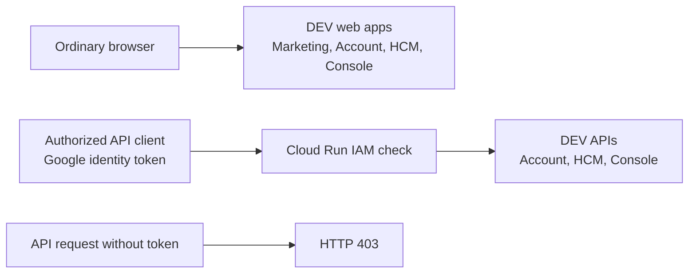
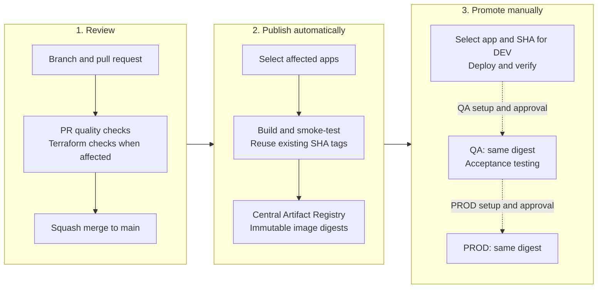

# empFLOWyee

empFLOWyee is an Nx/pnpm monorepo for four product surfaces: Marketing, Account, HCM and Console. It contains seven independently deployable applications, shared runtime libraries, container tooling and Google Cloud infrastructure as code.

This README is the starting point for developing, deploying and supporting the repository. Architecture and operating rules are maintained in the linked documents under [`docs/`](docs/README.md). Read the [engineering constitution](AGENTS.md) before changing application boundaries, runtime behavior or infrastructure.

## Contents

- [Current implementation](#current-implementation)
- [Applications and environments](#applications-and-environments)
- [Developer setup](#developer-setup)
- [HCM Shell and Theme Lab](#hcm-shell-and-theme-lab)
- [Repository structure and architecture](#repository-structure-and-architecture)
- [Validation and contributions](#validation-and-contributions)
- [Build and deployment](#build-and-deployment)
- [Infrastructure and configuration ownership](#infrastructure-and-configuration-ownership)
- [Support and maintenance](#support-and-maintenance)
- [Documentation directory](#documentation-directory)

## Current implementation

Foundation status recorded on **2026-09-22**:

| Area         | Implemented                                                                                        | Remaining work                                                                   |
| ------------ | -------------------------------------------------------------------------------------------------- | -------------------------------------------------------------------------------- |
| Applications | Seven runnable apps; HCM fixture shell, Theme Lab, Nx boundaries and documentation rules           | Production floorplans, authenticated bootstrap and domain features               |
| Containers   | Seven Dockerfiles; health checks, runtime configuration, image smoke tests and local Compose stack | Business dependencies and migration orchestration                                |
| Delivery     | Protected `main`, PR checks, immutable image publication and manual per-app deployment             | QA/PROD activation, production rollout validation and further delivery hardening |
| Google Cloud | Shared delivery foundation and all seven DEV Cloud Run services in Mumbai                          | Separate QA/PROD provisioning and promotion                                      |
| DEV access   | Four directly accessible web apps; three IAM-protected APIs                                        | Product sign-in, tenant authorization and browser-to-API authentication          |
| Terraform    | Versioned remote state, provider locks, mocked tests and reviewed local applies                    | Dedicated infrastructure automation identity; automated apply remains disabled   |

The last recorded DEV release still displays framework welcome screens. The HCM Shell + Theme Lab implementation described below is available in source; it requires the normal reviewed release and manual promotion before appearing in DEV. APIs return the scaffold greeting at `/api`. A successful deployment proves the runtime foundation; it does not mean business workflows or application authentication are implemented. See the [deployment record](docs/platform/engineering/dev-deployment.md), [foundation readiness](docs/platform/engineering/cloud-run-readiness.md) and [next milestones](NEXT-STEPS.md).

## Applications and environments

The seven application names are stable identifiers shared by Nx, image publication and Cloud Run. E2E projects and libraries are not additional deployables.

| Application     | Source                                     | Runtime / UI                      | Local endpoint                                  | DEV endpoint                                                                  |
| --------------- | ------------------------------------------ | --------------------------------- | ----------------------------------------------- | ----------------------------------------------------------------------------- |
| `marketing-web` | [`apps/marketing/web`](apps/marketing/web) | Next.js / React                   | [localhost:4200](http://localhost:4200)         | [Marketing](https://marketing-web-bf3q2l4gtq-el.a.run.app)                    |
| `account-web`   | [`apps/account/web`](apps/account/web)     | Angular / Spartan                 | [localhost:4300](http://localhost:4300)         | [Account](https://account-web-bf3q2l4gtq-el.a.run.app)                        |
| `account-api`   | [`apps/account/api`](apps/account/api)     | NestJS                            | [localhost:4400/api](http://localhost:4400/api) | [Account API](https://account-api-bf3q2l4gtq-el.a.run.app/api) — IAM required |
| `hcm-web`       | [`apps/hcm/web`](apps/hcm/web)             | Angular / Fundamental NGX and UI5 | [localhost:4302](http://localhost:4302)         | [HCM](https://hcm-web-bf3q2l4gtq-el.a.run.app)                                |
| `hcm-api`       | [`apps/hcm/api`](apps/hcm/api)             | NestJS                            | [localhost:4402/api](http://localhost:4402/api) | [HCM API](https://hcm-api-bf3q2l4gtq-el.a.run.app/api) — IAM required         |
| `console-web`   | [`apps/console/web`](apps/console/web)     | Angular / PrimeNG                 | [localhost:4301](http://localhost:4301)         | [Console](https://console-web-bf3q2l4gtq-el.a.run.app)                        |
| `console-api`   | [`apps/console/api`](apps/console/api)     | NestJS                            | [localhost:4401/api](http://localhost:4401/api) | [Console API](https://console-api-bf3q2l4gtq-el.a.run.app/api) — IAM required |

Local endpoints become available after starting the corresponding development server or container. The UI column identifies each product's selected stack; the scaffold pages are not completed product UIs.

DEV web URLs open in an ordinary browser without a local proxy or Google IAM token. DEV API URLs return **403** without an authorized identity token, by design. Console's public scaffold does not grant platform operator privileges. [Access policy](docs/platform/security/cloud-run-access-baseline.md) and [authentication boundaries](docs/platform/architecture/authentication-boundaries.md) define this distinction.



This diagram describes current access. A browser-to-API product authentication flow is not implemented yet.

| Purpose                               | GCP project       | Status                                                   |
| ------------------------------------- | ----------------- | -------------------------------------------------------- |
| Shared registry, federation and state | `empflowyee-cicd` | Applied                                                  |
| DEV runtime                           | `empflowyee-dev`  | Seven apps deployed                                      |
| QA runtime                            | `empflowyee-qa`   | Terraform configuration checked offline; rollout pending |
| PROD runtime                          | `empflowyee-prd`  | Terraform configuration checked offline; rollout pending |

Region: `asia-south1` (Mumbai). DEV, QA and PROD are environments, not Git branches. The [approved cloud hierarchy](docs/platform/architecture/gcp-cloud-foundation.md) is the target design; the [readiness record](docs/platform/engineering/cloud-run-readiness.md) identifies which parts have actually been applied.

## Developer setup

### Prerequisites

| Tool                          | Requirement                                                                                               | Repository reference                                                |
| ----------------------------- | --------------------------------------------------------------------------------------------------------- | ------------------------------------------------------------------- |
| Git                           | Clone, branch and review changes                                                                          | [Git strategy](docs/platform/engineering/git-strategy.md)           |
| Node.js                       | 24.21.0 for workspace commands                                                                            | [`.node-version`](.node-version), [`.nvmrc`](.nvmrc)                |
| pnpm                          | 12.5.1                                                                                                    | [`package.json`](package.json), [`pnpm-lock.yaml`](pnpm-lock.yaml)  |
| Docker                        | Docker Desktop with Linux containers, or a compatible Linux Docker engine; Compose v2 for the local stack | [Local development](docs/platform/engineering/local-development.md) |
| Terraform                     | 1.16.3; needed for infrastructure work only                                                               | [`.terraform-version`](.terraform-version)                          |
| Google Cloud CLI / GitHub CLI | Needed for cloud operations and command-line release support                                              | [Maintainer handbook](docs/platform/engineering/maintenance.md)     |

Local application development does not require GCP credentials. The exact dependency resolution is recorded in the lockfile; the [version baseline](docs/platform/engineering/version-baseline.md) explains upgrade policy.

### Clone and install

Run from a terminal with Git and pnpm available:

```bash
git clone https://github.com/alarhoo/empflowyee.git
cd empflowyee
pnpm install --frozen-lockfile
pnpm exec node --version
pnpm nx show projects
```

The workspace's `devEngines.runtime` setting lets pnpm manage the pinned Node runtime. Use `pnpm exec node` for repository scripts; the shell's bare `node` can refer to a different installation. Do not rerun the scaffold commands when onboarding to an existing checkout.

### Develop individual applications

Start each required process in its own terminal. For example, HCM development uses:

```bash
pnpm dev:hcm-api
```

```bash
pnpm dev:hcm
```

Equivalent scripts are `dev:marketing`, `dev:account`, `dev:account-api`, `dev:console` and `dev:console-api`. Open the corresponding localhost URL from the application table. Stop any container using the same ports before starting a development server. Optional named-host mappings and runtime troubleshooting are documented in [local development](docs/platform/engineering/local-development.md).

### Run all seven container images

Use this path to inspect production builds locally:

```bash
pnpm nx run-many -t docker:build -p marketing-web,account-web,account-api,hcm-web,hcm-api,console-web,console-api --parallel=2
docker compose -f containers/compose.local.yml up -d --wait --wait-timeout 120
docker compose -f containers/compose.local.yml ps
```

Compose starts the images built by Nx, binds published ports to loopback and supplies local runtime configuration. It does not provide source hot reload. After changing source, rebuild the affected image and repeat `compose up`.

```bash
docker compose -f containers/compose.local.yml logs --tail=100
docker compose -f containers/compose.local.yml down
```

See the [container strategy ADR](docs/platform/adr/ADR-container-runtime-strategy.md), [Nx Docker integration](docs/platform/engineering/nx-docker-integration.md) and [container validation record](docs/platform/engineering/container-validation.md).

## HCM Shell and Theme Lab

HCM now composes five Nx libraries for fixture runtime context, navigation catalog, theme state, shell and the lazy Theme Lab. The four variants are **Horizon Light/Dark** and **HER Light/Dark**. Tenant branding accepts an optional validated hex accent; HER keeps native Horizon controls and the supplied semantic palette.

Start a source development server alongside the container stack:

```sh
pnpm nx serve hcm-web --port=4303 --host=127.0.0.1
```

Open [Theme Lab](http://127.0.0.1:4303/ux/theme-lab). Choose a theme, apply or clear an accent, inspect the four preview layouts, and use **Mock session** plus **Browse apps** to exercise role/entitlement filtering.

The milestone uses fictional in-memory data. It does not implement sign-in, backend calls, preference persistence or business transactions. Navigation visibility is not authorization, and the existing API access policy is unchanged.

Read the [HCM maintainer guide](docs/hcm/architecture/shell/README.md) for the library map, Mermaid composition/theme diagrams, validation commands and troubleshooting. The [TDD](docs/hcm/tdd/TDD-HCM-SHELL-THEME-LAB.md) records generator choices and deviations from the supplied templates. The [HCM documentation index](docs/hcm/README.md) links the architecture and next floorplan milestone.

## Repository structure and architecture

```text
apps/                    Thin application bootstrap/composition roots and E2E projects
libs/                    Product/domain implementation and explicit shared runtime libraries
docs/                    Architecture, product specifications, decisions and operating guides
containers/              Runtime templates, image catalog and local Compose configuration
ci/                      Deployable-to-image/service manifest
tools/                   Architecture, documentation, lint, container and release tooling
infra/bootstrap/         Organization/project/state-bucket bootstrap
infra/terraform/         Shared, environment and Cloud Run Terraform roots/modules
.github/workflows/       PR validation, image publication and manual deployment workflows
.ai/                     AI procedures; links to authoritative documentation
```

Application projects compose libraries; heavy implementation belongs under `libs/`. Product implementation libraries cannot import another product's implementation. Browser and server implementation code remain separate, with explicit universal contract libraries where needed. [Architecture invariants](docs/platform/architecture/invariants.md), [data ownership](docs/platform/architecture/data-ownership.md) and [dependency rules](docs/platform/engineering/nx/dependency-rules.md) define the boundaries.

Nx projects carry four tags: `product`, `runtime`, `domain` and `type`. For example, `hcm-web-leave-feature-apply` is a web feature in HCM's leave domain. A shared DTO library such as `hcm-leave-contract` omits runtime from its name but still has `runtime:universal`. Use the [project taxonomy](docs/platform/engineering/nx/project-taxonomy.md) before adding or renaming projects.

HCM is one Angular app with lazy-loaded business-domain libraries. Spaces and Pages are navigation concepts, not microfrontends or code ownership boundaries. Its approved UI stack is Fundamental NGX/UI5; Account uses Spartan and Console uses PrimeNG. New Angular state/forms prefer Signals/Signal Forms while Zone.js remains enabled. See the [HCM UI decision](docs/hcm/ux/UI-LIBRARY-DECISION.md), [state/forms policy](docs/platform/frontend/angular-state-and-forms.md) and [change-detection ADR](docs/platform/adr/ADR-0002-angular-change-detection-baseline.md).

## Validation and contributions

Work on a short-lived branch and open a PR to `main`. Use a Conventional Commit title such as `fix(hcm-web): handle missing runtime configuration`. `main` is protected; merge through a PR after the required checks pass. A merge can publish images but never deploys an application automatically.

Run the appropriate checks before requesting review:

```bash
pnpm architecture:check
pnpm docs:check
pnpm lint:tooling
pnpm test:lint-policy
pnpm nx run-many -t lint test build
pnpm nx format:check --uncommitted
```

For a committed branch, fetch the base and use affected validation:

```bash
git fetch origin main
pnpm nx affected -t lint test build --base=origin/main --head=HEAD --parallel=3
```

Every maintained JS/TS function implementation, including callbacks and tests, requires meaningful JSDoc. Maintained YAML requires purpose and behavior comments. Follow [code style](docs/platform/engineering/code-style.md); do not suppress policy checks to accept generated code. Infrastructure changes also require [Terraform validation and plan review](docs/platform/engineering/terraform.md).

Changes to runtime contracts, commands, access or delivery behavior must update the owning document and relevant README links in the same PR. See [documentation maintenance](docs/platform/engineering/maintenance.md#maintaining-documentation).

## Build and deployment

Application images are built once and promoted by immutable digest. The release identifier is a **full 40-character mainline commit SHA**. Each app can run a different release; an unaffected app does not automatically receive an image tag for every new commit.



An empty affected selection publishes no images. Publication and deployment use separate GitHub identities through Workload Identity Federation (WIF); no service-account keys are stored in GitHub. The [release runbook](docs/platform/engineering/release-process.md) includes the detailed authentication sequence and dispatch commands.

| Workflow                                                                             | Trigger and responsibility                                                                     |
| ------------------------------------------------------------------------------------ | ---------------------------------------------------------------------------------------------- |
| [`pr-ci.yml`](.github/workflows/pr-ci.yml)                                           | Validate PRs; no cloud credentials or deployment                                               |
| [`infra-validate.yml`](.github/workflows/infra-validate.yml)                         | Validate/test infrastructure changes with mocked providers                                     |
| [`release.yml`](.github/workflows/release.yml)                                       | Select apps after merge or manual dispatch; call the reusable image publisher                  |
| [`_reusable-build-image.yml`](.github/workflows/_reusable-build-image.yml)           | Build, smoke-test and publish, or reuse an existing immutable image                            |
| `deploy-<application>.yml`                                                           | Manually select an app's release SHA and environment; seven entry workflows                    |
| [`_reusable-deploy-cloud-run.yml`](.github/workflows/_reusable-deploy-cloud-run.yml) | Resolve the published digest, update an existing service's image and verify its ready revision |
| [`infra-apply.yml`](.github/workflows/infra-apply.yml)                               | Disabled placeholder for environment-foundation automation; does not apply the Cloud Run roots |

Dispatch deployments from `main` and **one at a time per environment**. Wait for one run to finish before starting the next; the shared concurrency group does not preserve an arbitrary queue of pending deployments. Never overlap a local Terraform apply with a deployment. See [workflow concurrency](docs/platform/engineering/workflow-concurrency.md).

For rollback, dispatch the same app's deployment workflow with a previous known-good, already-published SHA. Do not rebuild old source or use `latest`. See [rollback](docs/platform/engineering/rollback.md).

## Infrastructure and configuration ownership

The [infrastructure README](infra/README.md) describes the state layout, provisioning diagram and operational entry points.

| Owner                                               | Responsibility                                                                                                       |
| --------------------------------------------------- | -------------------------------------------------------------------------------------------------------------------- |
| Bootstrap tooling                                   | Resource hierarchy, project placement, billing linkage and protected state bucket                                    |
| Shared Terraform root                               | Central Artifact Registry, WIF provider and builder identity                                                         |
| Environment Terraform roots                         | APIs, deployer IAM, dedicated runtime identities and registry-read permissions                                       |
| Cloud Run Terraform roots                           | Service existence, invocation policy, identity, resources, scaling, probes, traffic and stable runtime configuration |
| Release workflow                                    | Published application image digest and its embedded release identity                                                 |
| Product data / future authentication implementation | Tenant branding, preferences, entitlements and sign-in configuration                                                 |

Terraform ignores the deployed image after bootstrap so an infrastructure apply does not replace a promoted release. Application deployment changes the image only. Read the [ownership ADR](docs/platform/adr/ADR-cloud-run-terraform-ownership.md) before changing either path.

Environment-specific values are supplied at runtime, not compiled into browser bundles:

| Runtime | Configuration contract                                                                                                                  |
| ------- | --------------------------------------------------------------------------------------------------------------------------------------- |
| Angular | [`/assets/config.json`](docs/platform/engineering/angular-runtime-config.md), generated when the container starts                       |
| Next.js | [Server runtime configuration](docs/platform/engineering/next-runtime-config.md); public metadata at `/api/runtime-config`              |
| NestJS  | [Validated environment configuration](docs/platform/engineering/nest-container-standard.md) before listening; graceful shutdown enabled |

Browser configuration is public. Application secret values belong in Secret Manager; no application secrets or database are provisioned by the current scaffold. Local backend/variable files, state and plans are ignored by Git. A new maintainer must reconstruct the reviewed local Terraform configuration, including Angular API endpoints, before planning against the existing state. Follow the [maintenance setup procedure](docs/platform/engineering/maintenance.md#prepare-a-new-maintainers-cloud-checkout).

Current GitHub activation: `RELEASE_PIPELINE_ENABLED=true`, `INFRA_PIPELINE_ENABLED=false`; only `cicd` and `dev` are configured for the completed rollout. The [GitHub setup guide](docs/platform/engineering/github-setup.md) and [WIF policy](docs/platform/engineering/github-gcp-wif.md) distinguish current state from future QA/PROD and Terraform automation prerequisites.

## Support and maintenance

Start with the [maintainer handbook](docs/platform/engineering/maintenance.md) for diagnosis, credential setup, drift review, upgrades and operational evidence.

| Symptom                                                     | First check                                                                                                                         |
| ----------------------------------------------------------- | ----------------------------------------------------------------------------------------------------------------------------------- |
| DEV web app returns 403                                     | Confirm the URL, then compare its invocation setting with the [DEV web-access ADR](docs/platform/adr/ADR-dev-web-browser-access.md) |
| DEV API returns 403                                         | Verify the caller has IAM invocation permission and sends an identity token; anonymous access is intentionally denied               |
| Runtime configuration error or missing API URL              | Inspect public runtime metadata and the Terraform `api_base_urls` settings                                                          |
| `Invalid regular expression flags` during Nx graph creation | Verify `pnpm exec node --version`; reset an old Nx daemon after restoring the pinned runtime                                        |
| Deployment cannot find a release image                      | Check the selected app was built for that exact SHA; affected builds may skip unchanged apps                                        |
| Terraform reports a missing/foreign runtime identity        | Check the environment foundation state; do not substitute a different service account                                               |
| Reusable-workflow editor squiggles                          | Check repository root, Git remote and editor GitHub context; validate with actionlint                                               |

Every app exposes `/health/live` and `/health/ready`. API health routes inherit Cloud Run IAM protection. Container health, application responses, release identity and access policy are separate checks; see [health/shutdown](docs/platform/engineering/health-and-shutdown.md) and [post-deployment verification](docs/platform/engineering/release-process.md#verify-a-deployment).

## Documentation directory

| Read this                                                            | For                                                                    |
| -------------------------------------------------------------------- | ---------------------------------------------------------------------- |
| [Documentation index](docs/README.md)                                | Architecture, product and operational reading paths                    |
| [Engineering constitution](AGENTS.md)                                | Repository-wide constraints for contributors and AI tools              |
| [Local development](docs/platform/engineering/local-development.md)  | Runtime selection, local URLs, Compose and development servers         |
| [Maintainer handbook](docs/platform/engineering/maintenance.md)      | Supporting an existing checkout and deployment                         |
| [Release process](docs/platform/engineering/release-process.md)      | Build, promote, verify and trace a release                             |
| [Infrastructure README](infra/README.md)                             | Provisioning dependencies and state ownership                          |
| [DEV deployment record](docs/platform/engineering/dev-deployment.md) | Live URLs, release/revision evidence and the browser-access correction |
| [Validation record](VALIDATION.md)                                   | Completed checks and their limits                                      |
| [Next steps](NEXT-STEPS.md)                                          | Product milestones and deferred infrastructure work                    |
