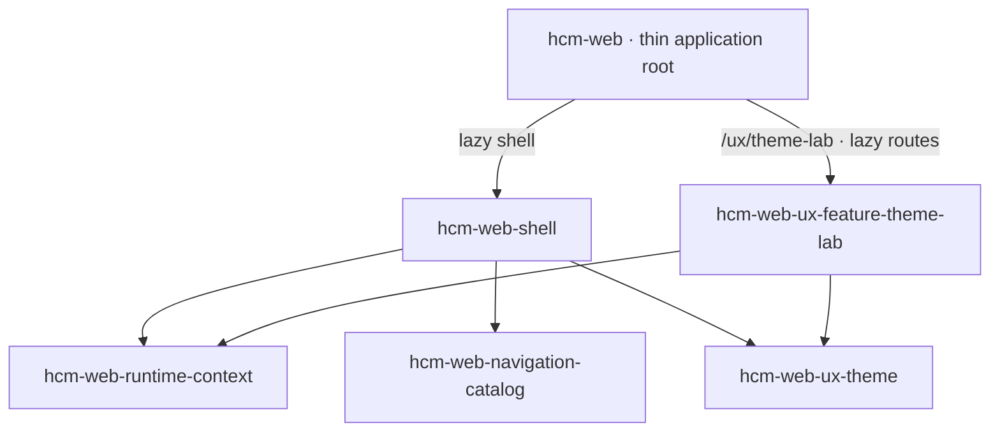
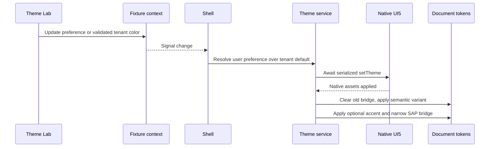

# HCM Shell and Theme Lab

This guide supports developers and maintainers working on the first HCM frontend milestone. Architecture is defined in the [TDD](../../tdd/TDD-HCM-SHELL-THEME-LAB.md), [theme ADR](../../adr/ADR-0002-her-theme-as-horizon-overlay.md), and adjacent shell documents.

## Run locally

Install the pinned toolchain and dependencies using the [repository setup](../../../../README.md#developer-setup), then run:

```sh
pnpm nx serve hcm-web --port=4303 --host=127.0.0.1
```

Open [Theme Lab](http://127.0.0.1:4303/ux/theme-lab). Port 4303 keeps this source development server separate from the existing HCM Docker endpoint on 4302. The normal `pnpm dev:hcm` command still uses 4302; use it when that port is free.

The existing public runtime configuration bootstrap is preserved. It reads `/assets/config.json` before Angular starts. Theme Lab uses in-memory fictional tenant/principal data and makes no HCM backend calls. Reloading resets the fixture, theme preference and tenant accent.

## Explore the fixture

1. Choose **Horizon Light**, **Horizon Dark**, **HER Light**, or **HER Dark**.
2. Enter `#0af` in **Tenant primary color hex**, then select **Apply color**. The accepted value becomes `#00aaff`. A color picker provides the same validated path.
3. Try invalid text. The error appears beside the field and the last accepted accent remains active.
4. Select **Use theme default** to remove the tenant overlay. HER restores its supplied palette; Horizon restores native SAP emphasis values.
5. Expand **Mock session — roles and entitlements**. Toggle roles and licensed capabilities, then inspect **Spaces** and **Browse apps**.
6. Choose each preview: **Overview**, **Object Page**, **Flexible Columns**, and **Table + Form**.

A Tenant Super Admin cannot bypass missing commercial entitlements. Theme Lab itself has no commercial entitlement requirement in the fixture. Its route remains reachable when its catalog entry becomes hidden, so all role combinations can be tested. This is intentional and is not an authentication guard.

Catalog entries with no implementation are labeled **Planned** and do not launch broken routes. Preview tiles and business actions are fictional: inputs are read-only and transaction buttons are disabled.

## Library map

All five libraries were created with the official Nx Angular generator. Import from their public `src/index.ts` aliases.

| Project / import suffix after `@empflowyee/` | Source from repository root         | Responsibility                                                               |
| -------------------------------------------- | ----------------------------------- | ---------------------------------------------------------------------------- |
| `hcm-web-runtime-context`                    | `libs/hcm/web/runtime/context`      | Fixture tenant/principal data and explicit signal-store mutations            |
| `hcm-web-navigation-catalog`                 | `libs/hcm/web/navigation/catalog`   | Pure Space → Page → Group → Feature definitions and visibility filtering     |
| `hcm-web-ux-theme`                           | `libs/hcm/web/ux/theme`             | Theme selection, native UI5 switching, semantic tokens and validated accents |
| `hcm-web-shell`                              | `libs/hcm/web/shell`                | Global chrome, visible catalog and preference composition                    |
| `hcm-web-ux-feature-theme-lab`               | `libs/hcm/web/ux/feature-theme-lab` | Lazy controls and four small schematic preview components                    |



The catalog receives role/entitlement identifier sets; it does not import the runtime store. The theme library does not import runtime context. The shell composes them, and the feature never imports the shell.

## Theme lifecycle

`apps/hcm/web/src/ui5-init.ts` registers core/Fiori assets and ignores Angular's `ef-` element prefix before Angular bootstrap. Global SCSS enters through the app stylesheet, outside component encapsulation.



Horizon uses native SAP parameters. HER keeps native Horizon controls and adds the supplied empFLOWyee surface palette. See [theming](theming.md) for the bridge parameter list, contrast behavior and source integrity requirement.

The primary-color editor uses Angular Signal Forms. Mock role toggles are immediate fixture commands. Read-only preview inputs are not business forms; production validation and edit flows belong to a later approved floorplan design.

## Validate a change

```sh
pnpm exec node tools/milestones/hcm-shell-theme-lab/verify-bundle.mjs
pnpm nx run-many -t lint test build --projects=hcm-web,hcm-web-e2e,hcm-web-runtime-context,hcm-web-navigation-catalog,hcm-web-ux-theme,hcm-web-shell,hcm-web-ux-feature-theme-lab --parallel=1
pnpm exec playwright test --config=apps/hcm/web-e2e/playwright.config.mts --workers=1
pnpm architecture:check
pnpm docs:check
```

The Playwright configuration starts a source development server on 4303, or accepts an explicit `BASE_URL` for an already-running build. Do not point it at an old scaffold container and treat that as testing the current source. Install matching browsers with `pnpm exec playwright install chromium firefox webkit` on a fresh workstation. Add `--project=chromium` for a shorter focused browser check.

Run Nx and Playwright sequentially on memory-constrained workstations. For a change to shared configuration or dependencies, also run `pnpm nx affected -t lint test build --uncommitted --parallel=1`. The [validation record](validation.md) describes the completed milestone checks and their limits.

Unit tests cover catalog role/entitlement rules, pruning, fixture updates, invalid colors, WCAG contrast calculations, complete overlay cleanup, asset failures and rapid theme selections. Browser tests cover all sixteen theme/preview combinations, native SAP background changes, branding controls, catalog changes, and 390px layouts. Keep a visual review of all four previews in the acceptance pass; these checks do not constitute a complete accessibility audit.

## Common problems

| Symptom                                             | Check                                                                                                                       |
| --------------------------------------------------- | --------------------------------------------------------------------------------------------------------------------------- |
| Framework welcome page still appears                | Confirm port 4303 and the source server; port 4302 may be an older Docker image.                                            |
| UI5 controls stay on the previous mode              | Check asset-loading errors, `ui5-init.ts`, and the asynchronous theme queue. Do not replace controls with custom CSS skins. |
| Accent persists after clearing                      | Verify every owned `--ef-*` and SAP inline property is removed before applying the next palette.                            |
| Space or tile disappears                            | Check mock roles and every required entitlement. Empty groups/pages/spaces are deliberately pruned.                         |
| Theme Lab remains reachable after removing its role | Expected fixture behavior; visibility is not authorization.                                                                 |
| HCM API returns 403                                 | APIs remain protected by Cloud Run IAM. This frontend milestone does not change that policy.                                |
| HER integrity check fails                           | Restore the supplied stylesheet exactly; do not let formatters rewrite it.                                                  |

## Next milestone

Complete the [component capability matrix](../../ux/COMPONENT-CAPABILITY-MATRIX.md), then design production floorplan compositions and their loading, empty, error, read-only, denied and responsive behavior. Authentication/bootstrap, real locale switching, persistence and domain transactions remain separate work. Follow [next steps](../../../../NEXT-STEPS.md).
