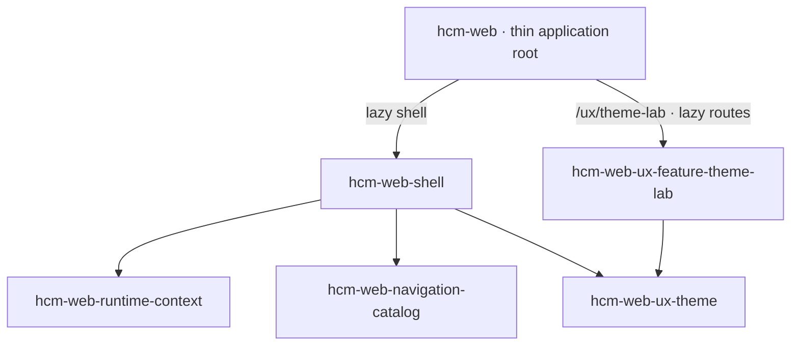
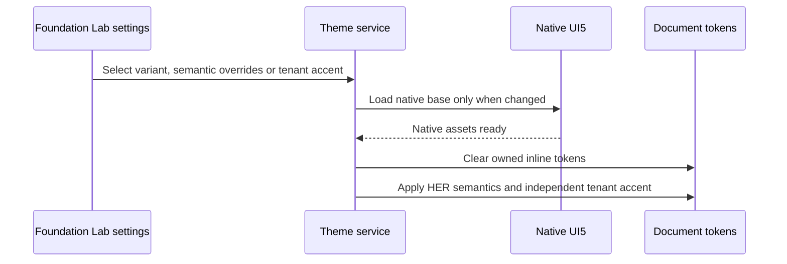

# HCM Shell and Theme Lab

This guide supports developers and maintainers working on the first HCM frontend milestone. Architecture is defined in the [TDD](../../tdd/TDD-HCM-SHELL-THEME-LAB.md), [theme ADR](../../adr/ADR-0002-her-theme-as-horizon-overlay.md), and adjacent shell documents.

## Current developer entry point

The [Foundation Lab v2 guide](../../ux/theme-lab/README.md) supersedes the old schematic lab, role-toggle playground and two-preview workflow. Use `pnpm dev:hcm --host=127.0.0.1` and open port **4302**, `/ux/theme-lab`. It has its own native ShellBar and Home/Demo/Settings tabs outside the business shell. Runtime configuration defaults it off in PROD.

The original business shell and catalog libraries remain in place at `/`. Their role/entitlement visibility rules remain separate from route authorization. Their fixture composition is described below for maintainers; the new lab no longer edits that runtime fixture.

## Library map

All five libraries were created with the official Nx Angular generator. Import from their public `src/index.ts` aliases.

| Project / import suffix after `@empflowyee/` | Source from repository root         | Responsibility                                                                 |
| -------------------------------------------- | ----------------------------------- | ------------------------------------------------------------------------------ |
| `hcm-web-runtime-context`                    | `libs/hcm/web/runtime/context`      | Fixture tenant/principal data and explicit signal-store mutations              |
| `hcm-web-navigation-catalog`                 | `libs/hcm/web/navigation/catalog`   | Pure Space → Page → Group → Feature definitions and visibility filtering |
| `hcm-web-ux-theme`                           | `libs/hcm/web/ux/theme`             | Theme selection, native UI5 switching, semantic tokens and validated accents   |
| `hcm-web-shell`                              | `libs/hcm/web/shell`                | Global chrome, visible catalog and preference composition                      |
| `hcm-web-ux-feature-theme-lab`               | `libs/hcm/web/ux/feature-theme-lab` | Native Foundation Lab and retained independent story examples               |

The catalog receives role/entitlement identifier sets; it does not import the runtime store. The theme library does not import runtime context. The shell composes them, and the feature never imports the shell.

## Theme lifecycle

`apps/hcm/web/src/ui5-init.ts` registers core/Fiori assets and ignores Angular's `ef-` element prefix before Angular bootstrap. Global SCSS enters through the app stylesheet, outside component encapsulation.

Horizon uses native SAP parameters. HER keeps native Horizon controls and adds the supplied empFLOWyee surface palette. See [theming](theming.md) for the bridge parameter list, contrast behavior and source integrity requirement.

The new lab uses Signal Forms for disposable profile, request, branding and JSON drafts. These do not implement business transactions.

## Validation and next milestone

Use the current [Foundation Lab validation commands](../../ux/theme-lab/README.md#validation-and-next-work). The [original validation record](validation.md) is historical evidence for the shell milestone, not acceptance of the new workspace. The [new acceptance record](../../ux/theme-lab/ACCEPTANCE-CRITERIA.md) tracks this milestone.

The existing Storybook Dynamic/Object Page examples remain separate; no Storybook work is included in Foundation Lab v2. Human visual approval precedes extraction of new reusable patterns. Authentication, persistence and real employee transactions require their own FDD/TDD. See [next steps](../../../../NEXT-STEPS.md).
