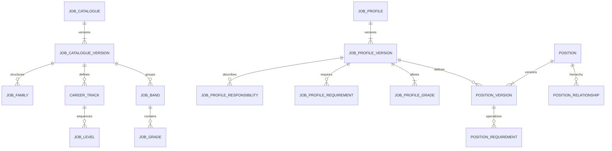

# Job Architecture — Domain Model

Job Architecture separates reusable work definitions, HR classifications, planned seats and incumbency.

## Core concepts

| Concept | Meaning | Explicitly not |
|---|---|---|
| Job Profile | Stable reusable work identity | Position/seat or employee |
| Job Profile Version | Immutable published description of purpose, scope, responsibilities, requirements and allowed grades | Employee job history |
| Position | Stable coded planned/budgeted seat | Person or assignment |
| Position Version | Effective-dated organizational placement/capacity of a Position | Incumbency |
| Assignment | Workforce Foundation fact that a person/employment occupies work | Position definition |
| Designation | Display title | Job profile, grade, band or authorization |
| Job Level | Scope/autonomy step in a career track | Grade or salary band |
| Job Grade | Ordered HR classification | Salary amount |
| Job Band | Non-monetary grouping of grades | Compensation range |

## Relationships

## Incumbency

Assignment owns incumbency. Position does not store a person/worker. Remaining capacity is derived from the effective Position Version minus effective Assignment occupancy. If occupancy cannot be established completely, the system must not silently interpret it as zero.

## Publication/versioning

Published catalogue, job-profile and position versions are immutable. Corrections create successor versions. Effective ranges for versions of the same stable aggregate do not overlap.

## HCM-2 applications

- `JOB_CATALOGUE`
- `POSITIONS`
- `POSITION_REQUIREMENTS`
