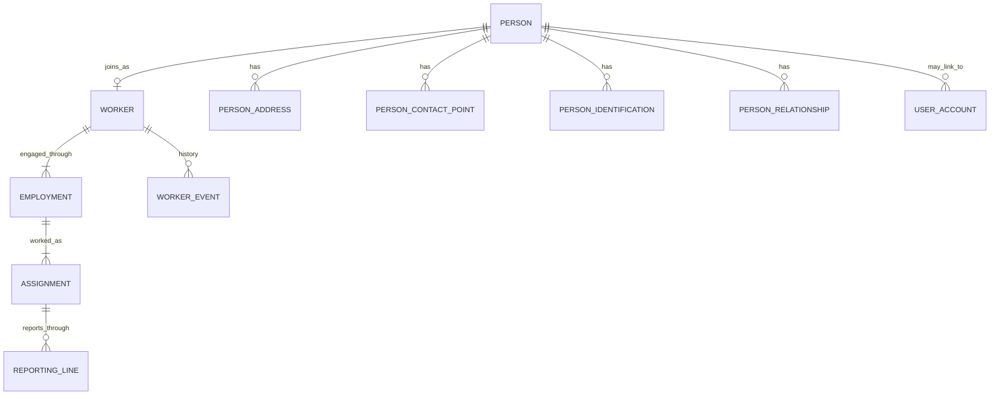

# Workforce Foundation — Domain Model

This domain owns the canonical workforce identity and effective-dated employment facts used by HCM. It deliberately avoids a single `Employee` aggregate.

## Core lifetimes

| Concept        | Meaning                                                | Lifetime rule                                                       |
| -------------- | ------------------------------------------------------ | ------------------------------------------------------------------- |
| **Person**     | The human being                                        | Survives jobs, termination and rehire                               |
| **Worker**     | That person as a member of an Organization's workforce | Reused across employments within the Organization                   |
| **Employment** | One continuous engagement with one Legal Entity        | Rehire creates another Employment                                   |
| **Assignment** | The work actually being performed                      | Transfer/promotion changes Assignment rather than rewriting history |

A current employee screen is a projection across these concepts; it is not justification for an `employee` table.

## Structural dependencies

HCM requires Organization, Legal Entity, Organization Unit, Department, Location and Designation context. Commercial onboarding, tenant subscription and brand ownership remain outside this domain. HCM must not create a competing commercial tenant model.

The current local HCM database already contains minimal `hcm.organisation`, `hcm.location`, `hcm.person`, `hcm.worker`, `hcm.employment` and `hcm.assignment` tables. HCM-2 must evolve those tables or explicitly migrate them. It must not introduce duplicate parallel aggregates with different names.

### Organization structure

- One tenant has one Organization in the current product model.
- Multiple legal employers are represented by Legal Entities, not multiple Organizations.
- Organization Units form a configurable effective-dated hierarchy.
- Department is a functional structure and is not forced into the Organization Unit tree.
- Designation is a display/title concept only. It is not job level, grade, authorization or compensation.
- Location is tenant-owned and carries local context such as time zone.

## Workforce relationships

## Important semantics

- Work email belongs to Employment, not User Account and not personal contact data.
- Reporting Line points to Assignments so manager history remains correct after transfers.
- Reporting is a business relationship, never an authorization grant.
- Worker Event records _why_ a committed change happened. It is append-only explanatory evidence, not the source of truth for current state.
- Current projections must identify concurrent employments/assignments explicitly and never guess.
- Rehire reuses Person and Worker and creates a new Employment.
- User Account is sign-in identity and may exist without a Person (service/external/pre-hire cases).
- Sensitive identifiers expose masked display values; plaintext is not searchable/loggable/exportable.

## HCM-2 responsibilities

This domain directly supports:

- `IDENTIFICATION_TYPES`
- `LOOKUP_VALUES`
- `ORG_CHART`
- `ORGANIZATION_STRUCTURE` (added by DEC-HCM2-014)

It also provides the data spine for Employee, Job Architecture and every later HCM domain.
