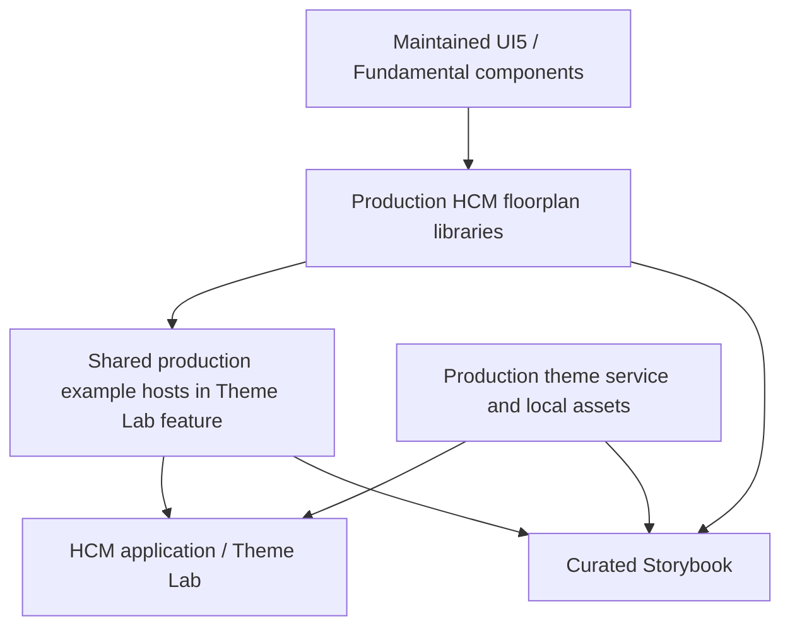

# HCM canonical UX catalog

Storybook documents the production HCM UX implementations and their acceptance status. Theme Lab is the exploratory developer surface. Both consume the same production floorplans and example components; stories contain inputs and assertions, not an alternative layout.

## Start locally

Install the pinned workspace dependencies, then run:

```bash
node tools/ux/check-component-entrypoints.mjs
node tools/ux/check-storybook-readiness.mjs
pnpm nx storybook hcm-web
```

Open [localhost:6006](http://localhost:6006). Run `pnpm dev:hcm` and open [/ux/theme-lab](http://localhost:4302/ux/theme-lab) for the application consumer. On Windows worker-start failures, set `NX_DAEMON=false` and `NX_ISOLATE_PLUGINS=false` in the current terminal.

The current Theme Lab pilots are Object Page and ToolPageLayout. Storybook exposes those shared implementations alongside the earlier Dynamic Page proof. Other previously generated patterns are deferred and excluded from story discovery. Their source presence does not approve production use. See the [validation record](floorplans/validation.md) for evidence and limits.

## Production ownership



Floorplans own domain-neutral regions and presentation contracts. Examples own fictional data, local search and disposable edits. Real features own requests, authorization and domain behavior. Story fixtures may replace data/services; they may not replace production layout.

## Information architecture

- **Foundations:** Themes, Tenant Branding, Typography, Density, Responsive Behavior.
- **Shell:** HCM Shell, Spaces Navigation, User/Session Area, Application Catalog.
- **Floorplans:** Native and Composed.
- **Patterns:** Forms, Enterprise Table, Search and Filter, Object Header, Actions, Empty State, Error State, Permission State, Unsaved Changes.
- **Examples:** Employee Profile, Employee Directory, Apply Leave, Leave Approval.

This is a target taxonomy, not a requirement to populate empty sections. Raw controls belong in upstream documentation unless HCM adds meaningful behavior.

The ordinary catalog includes **Floorplans / Native / Dynamic Page**, **Floorplans / Native / ToolPageLayout** and **Floorplans / Composed / Object Page**. The current pilots carry review notices; historical Core/Platform accessibility evidence does not approve the new UI5 composition. Story fixtures supply data and projected content to production components, never a separate layout implementation.

## Presentation controls

Compact is the default density. The toolbar can switch to cozy; both use the production density services and supported UI5 density marker.

The initial theme is Horizon Light with **No tenant override**. This branding option clears only the independent accent overlay; it does not change the selected theme. All four Horizon/HER variants remain available, together with Amethyst, Coral and Emerald sample accents, Cozy/Compact density and desktop/tablet/phone viewports.

Both hosts import the same UI5 initialization and `provideHcmUx()` providers. Fonts and native theme assets are served locally from locked packages under `/assets/hcm/`. Native Fundamental and UI5 themes are coordinated by the production theme service. A theme-loading error is visible and does not falsely advance the applied-theme state.

## Admission and quality

A canonical story identifies the production export, intended use/non-use cases, content regions, state semantics and meaningful interactions. Verify all four themes, tenant accent removal without reload, desktop/tablet/phone behavior, keyboard access, focus, headings and announcements.

Do not add one story per checklist item unless it demonstrates a distinct contract. Read-only preserves non-mutating actions. Empty results, missing objects, unavailable capabilities and permission failures must not be interchangeable. UI state is not an authorization boundary.

New candidates stay out of the explicit discovery list until their implementation and acceptance evidence are reviewed. Do not expand the catalog just to meet a directory or story count. Keep implementation in libraries and uphold Nx boundaries.

## Build and verify

```bash
pnpm nx build-storybook hcm-web --configuration=ci
pnpm nx static-storybook hcm-web
```

In another terminal:

```bash
pnpm nx test-storybook hcm-web
```

Both floorplans and all 15 stories are included by default. For the full acceptance check against a running Storybook:

```bash
node tools/ux/verify-workshop.mjs
```

`HCM_STORYBOOK_URL` may override the default `http://localhost:6006`. No review flag or second Storybook server is required. The full checker still reports the documented Object Page accessibility findings; use focused native-theme checks when changing only palette mappings.

The browser check validates native interactions, theme transitions and responsive behavior, and stores local evidence under `.tmp/hcm-workshop/`. PR CI builds affected Storybooks; it does not deploy them. Browser verification remains a local acceptance procedure unless explicitly added to CI.

The existing stable Angular renderer retains Zone.js. Storybook is a target of `hcm-web`, not an eighth deployable. Account, Console and Marketing Storybooks remain outside this scope.

See the [API guide](floorplans/README.md), [installed capabilities](floorplans/component-capability-matrix.md), [approved design](../tdd/TDD-HCM-UX-FLOORPLANS-STORYBOOK.md) and [reuse ADR](../adr/ADR-0004-floorplan-reuse-first.md).
