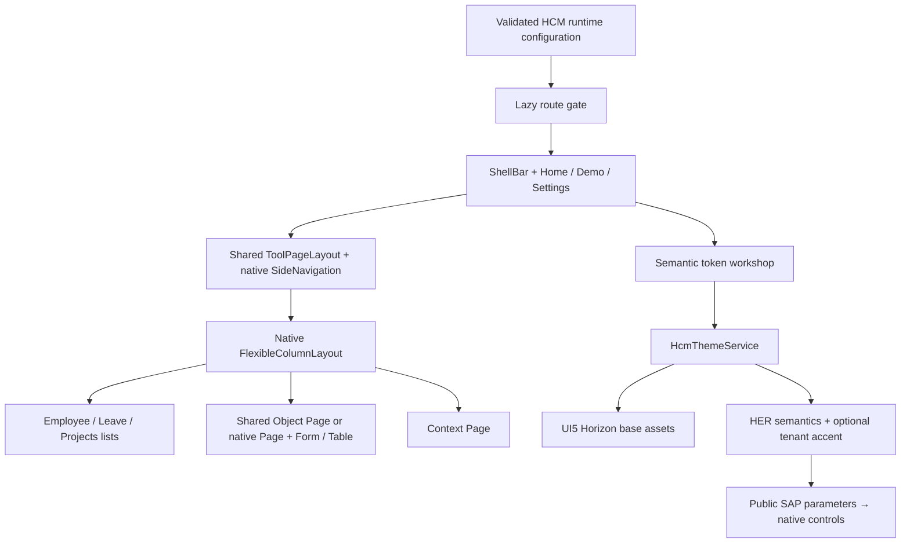

# HCM UX Foundation Lab

The Foundation Lab is the HCM developer workspace for testing maintained UI5 controls with Horizon, HER and tenant branding. It runs inside `hcm-web` at `/ux/theme-lab`. Its Employee, Leave and Projects examples use deterministic fictional data and make no product API calls.

The lab is exploratory. A working example does not approve a reusable floorplan for business features. The two reusable pilots, Object Page and ToolPageLayout, already live in floorplan libraries and are consumed here. Visual review and an approved feature TDD govern business-feature adoption. Storybook renders the same production components.

## Run locally

Use the Node and pnpm versions pinned in the repository, install dependencies, and start the HCM source server:

```sh
pnpm install --frozen-lockfile
pnpm dev:hcm --host=127.0.0.1
```

Open [the lab on port 4302](http://127.0.0.1:4302/ux/theme-lab). If another process owns that port, stop that known server or explicitly choose another port with `pnpm nx serve hcm-web --port=4303 --host=127.0.0.1`. A running container serves its built image and does not reflect source edits.

## Explore the workspace

The lab follows the [HCM page layout standard](../page-layout.md). Every content screen/column has a page header and can use a native footer. The application and Storybook share a centered 90rem maximum canvas with responsive side gutters. Do not add another width cap inside the lab or its floorplans.

1. **Home** shows the selected theme, native base, tenant accent, density, locale, warnings and control inventory. Shell search opens the matching employee search or the Leave/Projects area. Open the shell avatar to switch between Horizon Light/Dark and HER Light/Dark without leaving the current screen. Compact is the default density; Settings can switch to cozy. Notifications are a native local preview.
2. **Demo → Employee** provides name/role/ID search, department filtering and sorting. Select a person to open the native FCL middle column. **Edit profile** enables Signal Form fields; **Save preview** keeps that draft locally and **Cancel** restores the last local save. Select another employee to reset the draft.
3. Profile tabs exercise native forms, verification controls, skills, leave requests, employment timelines, document collections and project assignments. Related records open the FCL end column. Document selection reads filenames only; no bytes are uploaded.
4. **Demo → Leave** filters and sorts requests, shows dates and calendars, and opens approval context. **New request** produces a disposable preview, not a submitted transaction.
5. **Demo → Projects** shows assignments and progress. Following a project, capacity sliders and action menus affect the local preview only.
6. **Settings** selects a theme, applies or removes a tenant accent, edits the finite HER token contract, and exports/imports JSON. Density and RTL affect native controls. Locale changes native UI5 language assets and the fixed appointment preview; timezone affects that appointment. Business example copy is not translated.

## Runtime gate

HCM extends the common public runtime configuration with optional boolean `hcmThemeLabEnabled`:

| Configuration | Result |
| --- | --- |
| Field omitted, `environment: "prod"` | Disabled |
| Field omitted, local/DEV/QA | Enabled |
| Explicit `false` | Disabled in every environment |
| Explicit `true` | Enabled in every environment |

For local development edit `apps/hcm/web/public/assets/config.json`. The Angular container accepts optional `HCM_THEME_LAB_ENABLED=true` or `false`; leave it unset for environment defaults. The HCM parser rejects non-boolean JSON values. The lazy route's `canMatch` check runs before loading the feature and redirects disabled access to `/`.

This is public developer-tool configuration, not authorization. It does not protect secrets or implement tenant access control. The common platform contract remains product-independent; HCM owns this extension in `hcm-web-runtime-context`.

## Implementation map

All paths below are relative to the repository root.

| Location | Responsibility |
| --- | --- |
| `apps/hcm/web/src/app/app.routes.ts` | Lazy route and runtime gate; the lab has its own native shell |
| `apps/hcm/web/src/ui5-init.ts` | UI5 main/Fiori assets and explicitly imported shell/navigation icons |
| `libs/hcm/web/ux/feature-theme-lab/src/lib/theme-lab.component.*` | ShellBar, main TabContainer and Home |
| `libs/hcm/web/ux/floorplans/tool-page-layout/` | Reusable native NavigationLayout integration; header, navigation and content slots |
| `libs/hcm/web/ux/floorplans/object-page/` | Reusable native DynamicPage, actions and tabbed section composition |
| `…/lab-demo.component.*` | ToolPageLayout consumer, area navigation and native FCL for all three areas |
| `…/lab-profile.component.*` | Object Page consumer; employee fields, local actions and native section controls |
| `…/lab-settings.component.*`, `…/lab-settings.store.ts` | Signal-based workshop and validated import/export |
| `…/lab-data.ts` | Fictional employees, related requests and project membership |
| `libs/hcm/web/ux/theme/src/lib/her-token-contract.ts` | Finite token names and validation |
| `libs/hcm/web/ux/theme/src/lib/hcm-theme.service.ts` | Theme resolution, override ownership and cleanup |
| `libs/hcm/web/ux/theme/src/lib/hcm-sap-theme-parameters.ts` | Public SAP parameter bridge used by native controls |



## Theme ownership and reset

The checked-in HER SCSS and supplied reference palette remain unchanged. The four variants select `sap_horizon` or `sap_horizon_dark`, then optionally layer HER semantics and a tenant accent. Native theme assets load before the applied-variant marker changes. Semantic edits reuse an already loaded native base.

Horizon removes inline HER tokens and HER-owned SAP parameter overrides. An independent tenant accent remains until explicitly reset. A retained HER draft is inactive on Horizon and becomes active again when returning to HER. **Reset HER defaults** clears token edits without erasing tenant branding; **Reset tenant override** does the reverse.

Imports are validated in full before mutation. Only schema version 1, a HER base, an optional hex tenant color, and the governed token map are accepted. Colors are three- or six-digit hex; radii are bounded to 32px/2rem; shadows come from a finite list. Unknown fields, tokens and arbitrary CSS are rejected. Export includes overrides rather than a copy of every computed CSS property.

Changes are memory-only. Reloading or leaving the lab discards drafts; teardown releases direction/density/language previews and restores unbranded Horizon Light. Contrast checks warn about strong/muted text against the base surface and text on emphasized actions; they are not a complete accessibility audit.

## Validation and next work

```sh
pnpm nx run-many -t lint test -p hcm-web,hcm-web-runtime-context,hcm-web-ux-theme,hcm-web-ux-feature-theme-lab,platform-web-runtime-shell --parallel=2
pnpm nx build hcm-web --configuration=production
pnpm exec playwright test --config apps/hcm/web-e2e/playwright.config.mts --project=chromium --workers=1
```

The browser tests cover profile editing, native navigation/FCL, the four themes on actual native form surfaces, token import/reset, runtime gating and 1440/768/390px viewports. See [acceptance criteria](ACCEPTANCE-CRITERIA.md) for the verification record and remaining human review. Control inventory alone is not acceptance evidence.

Related truth: [FDD](../../fdd/FDD-HCM-UX-FOUNDATION-LAB.md), [TDD](../../tdd/TDD-HCM-UX-FOUNDATION-LAB.md), [ADR](../../adr/ADR-HCM-UX-FOUNDATION-LAB-v2.md), [token contract](THEME-TOKENS.md), [control coverage](CONTROL-COVERAGE.md), [fixtures](DEMO-DATA.md).
