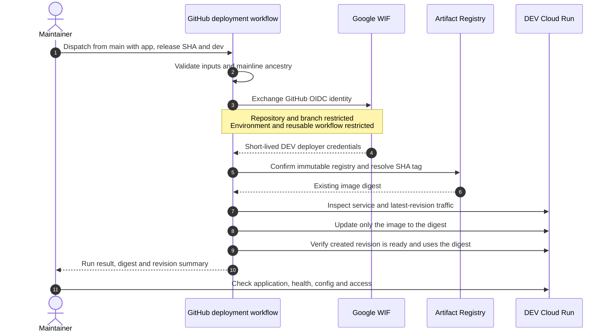

# Release process

This runbook covers application image publication and promotion. Infrastructure configuration follows [Terraform operations](terraform.md). A release updates an existing service's image; it does not create services, change access policy or set runtime environment variables.

## Prerequisites and current scope

- The release commit must be reachable from `main`, and its full lowercase 40-character SHA identifies the artifact.
- The selected deployable must have an image published for that SHA in the immutable central registry. An affected-only build may skip unchanged apps.
- The target service, dedicated runtime identity, runtime configuration and latest-revision traffic must already exist.
- The matching GitHub Environment must have its exact-main deployment restriction and the variables described in [GitHub setup](github-setup.md).
- Dispatch from `main`; select the release SHA as an input, including for rollback.

As of the [recorded DEV rollout](dev-deployment.md), `cicd` and `dev` are configured and `RELEASE_PIPELINE_ENABLED=true`. QA/PROD are the intended promotion sequence, but their setup and rollout remain separate work. `INFRA_PIPELINE_ENABLED=false` does not prevent application deployment; it disables the unconfigured infrastructure automation path.

## 1. Merge and publish

Create a short-lived branch, open a PR, pass the required checks and squash merge to `main`. The [release workflow](../../../.github/workflows/release.yml) selects affected deployables. Shared container/release inputs and an explicit full build can select all seven; an empty selection publishes nothing.

For each selected app, the reusable publisher authenticates as the CICD builder through WIF. A missing SHA tag triggers an Nx Docker build, image smoke test and push. An existing immutable tag is reused. Registry permission errors are failures, not evidence that an image is missing.

Inspect the **Build Release Artifacts** run and each app summary for the release SHA and digest. Publication never deploys a service. See [artifact promotion](artifact-promotion.md) for tag immutability and retry rules.

To intentionally publish a complete release from the current `main`, use GitHub Actions → **Build Release Artifacts** → **Run workflow**, select `main`, and set `build_all=true`. CLI equivalent:

```bash
gh workflow run release.yml --repo alarhoo/empflowyee --ref main -f build_all=true
```

This command publishes artifacts and can incur build/registry usage. It builds the workflow's current mainline commit; it is not a mechanism for rebuilding a previously promoted release. Inspect the resulting run's SHA rather than assuming the local checkout's HEAD was selected.

## 2. Promote one application

Use the app's dedicated deployment workflow:

| Deployable      | Workflow                                                                        |
| --------------- | ------------------------------------------------------------------------------- |
| `marketing-web` | [deploy-marketing-web.yml](../../../.github/workflows/deploy-marketing-web.yml) |
| `account-web`   | [deploy-account-web.yml](../../../.github/workflows/deploy-account-web.yml)     |
| `account-api`   | [deploy-account-api.yml](../../../.github/workflows/deploy-account-api.yml)     |
| `hcm-web`       | [deploy-hcm-web.yml](../../../.github/workflows/deploy-hcm-web.yml)             |
| `hcm-api`       | [deploy-hcm-api.yml](../../../.github/workflows/deploy-hcm-api.yml)             |
| `console-web`   | [deploy-console-web.yml](../../../.github/workflows/deploy-console-web.yml)     |
| `console-api`   | [deploy-console-api.yml](../../../.github/workflows/deploy-console-api.yml)     |

In GitHub Actions, choose **Run workflow**, keep the branch at `main`, enter the already-published release SHA and select `dev`. CLI equivalent, after replacing the placeholder:

```powershell
$releaseSha = 'REPLACE_WITH_PUBLISHED_40_CHARACTER_MAINLINE_SHA'
gh workflow run deploy-hcm-web.yml --repo alarhoo/empflowyee --ref main -f "release_sha=$releaseSha" -f environment=dev
gh run list --repo alarhoo/empflowyee --workflow=deploy-hcm-web.yml --limit=5
```

This dispatch changes the DEV service image. Identify the new run by its app, environment and SHA; inspect its result and summary. Do not assume the first historical run is the new dispatch. The reusable workflow validates inputs and mainline ancestry before acquiring cloud credentials.



The pipeline verifies ready revision and image identity. Browser rendering, anonymous access, API authentication and business acceptance checks remain explicit post-deployment verification; the workflow does not currently perform all of them.

## 3. Coordinate a multi-app release

Dispatch one app, wait for its deployment to finish, verify it, then dispatch the next. All deployment jobs for an environment share `cloud-run-<environment>`. A standard concurrency group retains only one pending job; dispatching seven simultaneously can cancel waiting deployments even though `cancel-in-progress` is false.

There is no automatic seven-service transaction or rollback. Track which app/digest pairs have completed. On a failure, investigate before continuing, and roll back the affected app if required. Follow the dependency order required by the feature's TDD; the current greeting-only scaffolds do not establish a future business dependency order.

Never run a local Terraform apply concurrently with an application deployment. Local Terraform does not participate in GitHub concurrency. See [workflow concurrency](workflow-concurrency.md).

## Verify a deployment

1. Confirm the workflow completed successfully and record its run URL, app, environment, release SHA and digest.
2. Inspect Cloud Run: latest created revision equals latest ready revision, the deployed digest matches, the expected dedicated identity is assigned, and traffic follows the latest revision at 100%.
3. Check `/health/live` and `/health/ready`. Authenticate when the service requires IAM invocation.
4. Open each changed web app without an identity-token header. Verify its page, JavaScript, CSS and runtime configuration. Angular uses `/assets/config.json`; Marketing uses `/api/runtime-config`. The embedded `releaseId` must match the selected artifact's SHA.
5. For the current DEV APIs, verify anonymous requests remain 403 and an authorized request to `/api` returns the expected scaffold response. Product-specific acceptance replaces the greeting check as features are implemented.
6. Investigate unexpected configuration or access changes through the owning Terraform root. Run a fresh plan after infrastructure changes to check for drift.

The [maintainer handbook](maintenance.md#inspect-a-deployed-application) provides read-only inspection commands and a private API example. Verification must respect the [DEV access policy](../security/cloud-run-access-baseline.md); do not make an API public to pass a smoke test.

## Promotion and rollback

After the target environment is independently provisioned and approved, promote the **same existing digest** from DEV to QA, perform acceptance testing, then promote it to PROD. Environment-specific configuration comes from that environment's infrastructure. Do not rebuild for promotion.

For rollback, use the same app workflow with a previous known-good published SHA and verify it through the same steps. The [rollback guide](rollback.md) covers infrastructure and database compatibility limits.
