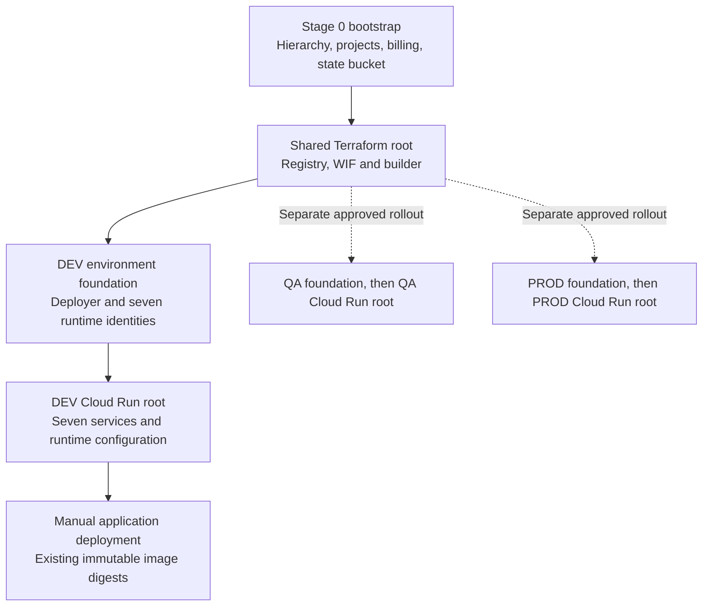

# empFLOWyee infrastructure

Infrastructure is managed as code. This directory owns bootstrap tooling and Terraform configuration; application image publication and promotion are handled by [GitHub workflows](../.github/workflows). Start with the [repository README](../README.md) for developer setup and the [maintainer handbook](../docs/platform/engineering/maintenance.md) for taking over an existing deployment.

## Current scope

The shared delivery foundation and DEV runtime foundation are applied in `asia-south1`. All seven real application images are deployed to DEV. Four DEV web services accept ordinary browser requests; three APIs require Cloud Run IAM authentication. QA/PROD roots have been checked offline but are not part of the completed rollout.

The exact applied resource hierarchy, IAM changes and validation evidence are recorded in [DEV readiness](../docs/platform/engineering/cloud-run-readiness.md). The architecture's full hierarchy is a target, not a claim that every environment has been provisioned.

## Directory and state ownership

| Location                                                                                | Owns                                                                                | Remote state prefix                                                       |
| --------------------------------------------------------------------------------------- | ----------------------------------------------------------------------------------- | ------------------------------------------------------------------------- |
| [`bootstrap/`](bootstrap/README.md)                                                     | Organization folders, project placement, billing linkage and state bucket bootstrap | Outside the Terraform roots; importing ownership requires a separate plan |
| [`terraform/shared/`](terraform/shared/README.md)                                       | Immutable Artifact Registry, GitHub WIF and builder identity                        | `shared`                                                                  |
| [`terraform/environments/dev/`](terraform/environments/dev/README.md)                   | DEV APIs, deployer IAM and seven dedicated runtime identities                       | `environments/dev`                                                        |
| [`terraform/environments/qa/`](terraform/environments/qa/README.md)                     | Corresponding QA foundation configuration                                           | `environments/qa`                                                         |
| [`terraform/environments/prod/`](terraform/environments/prod/README.md)                 | Corresponding PROD foundation configuration                                         | `environments/prod`                                                       |
| [`terraform/cloud-run/dev/`](terraform/cloud-run/dev/README.md)                         | Seven DEV services and their stable configuration/access                            | `cloud-run/dev`                                                           |
| [`terraform/cloud-run/qa/`](terraform/cloud-run/qa/README.md)                           | Corresponding QA service configuration                                              | `cloud-run/qa`                                                            |
| [`terraform/cloud-run/prod/`](terraform/cloud-run/prod/README.md)                       | Corresponding PROD service configuration                                            | `cloud-run/prod`                                                          |
| [`terraform/modules/cloud-run-service/`](terraform/modules/cloud-run-service/README.md) | Reusable Cloud Run v2 service implementation                                        | Resources belong to the calling root's state                              |

The older [`environments/`](environments) and [`modules/`](modules/README.md) locations are pointers, not alternate Terraform roots. The active roots are under `terraform/`.

Remote state lives in `gs://empflowyee-tfstate-242771450903` in `empflowyee-cicd`, with versioning and public access prevention. State prefixes separate state files; they are not IAM boundaries. Use the committed `.terraform.lock.hcl` in each root and the version in [`.terraform-version`](../.terraform-version).

## Provisioning order



Cloud Run roots read the matching environment foundation's runtime-account map through remote state. They reject an incomplete map, a foreign project or a foreign foundation prefix. The shared foundation supplies the registry and federation used by application delivery.

Do not rerun bootstrap as a routine maintenance step: its full scope includes more than DEV. Existing resources require an explicit ownership/import plan. A successful DEV apply is not authorization to apply QA or PROD.

## Infrastructure versus application release

Terraform owns service creation, runtime identities, ingress/invocation, resource limits, scaling, probes, latest-revision traffic and stable runtime configuration. Release workflows own the promoted immutable image. The module ignores subsequent changes to the image and deployment-client metadata, preserving the image-only release path.

The initial create uses a pinned bootstrap image; it is not a completed application deployment. Promotion replaces that image with a verified application artifact. Public DEV web invocation is explicitly allowed by [the access ADR](../docs/platform/adr/ADR-dev-web-browser-access.md); APIs and other environments remain private.

See [the ownership ADR](../docs/platform/adr/ADR-cloud-run-terraform-ownership.md), [Cloud Run operating guide](../docs/platform/engineering/cloud-run-terraform.md) and [service catalog](terraform/cloud-run/service-catalog.json).

## Validate and operate

From the repository root, offline validation of one stack is:

```bash
terraform -chdir=infra/terraform/cloud-run/dev init -backend=false -input=false -lockfile=readonly
terraform fmt -check -recursive infra/terraform
terraform -chdir=infra/terraform/cloud-run/dev validate
terraform -chdir=infra/terraform/cloud-run/dev test
```

For live operations, configure an authorized operator's ADC, review the ignored backend/variable files and restore deployed Angular API endpoints before planning. Follow the [new-maintainer setup](../docs/platform/engineering/maintenance.md#prepare-a-new-maintainers-cloud-checkout) and [Terraform plan/apply standard](../docs/platform/engineering/terraform.md). Never commit state, plans, credentials or local variable values.

Do not overlap a local apply with a deployment in the same environment. A local process is not protected by GitHub's concurrency lock. Always review a fresh plan after any intervening release.

`INFRA_PIPELINE_ENABLED` remains **false**. The existing workflow targets environment foundation roots, not the Cloud Run roots, and needs a separately approved Terraform identity/state-access design. The runtime deployer must not be reused as an infrastructure administrator.

## Deferred work

Cloud SQL, Secret Manager consumption/bindings, external HTTPS load balancing, custom domains/wildcard routing, operator authentication and monitoring expansion require their own designs. See [deferred cloud decisions](../docs/platform/architecture/deferred-cloud-decisions.md) and [deferred runtime decisions](../docs/platform/architecture/deferred-runtime-decisions.md). The Cloud Run service module and DEV service rollout are already implemented.
